---
## Front matter
title: "Отчёт по лабораторной работе №8"
subtitle: "Текстовой редактор vi"
author: "Митичкина Екатерина Павловна"

## Generic otions
lang: ru-RU
toc-title: "Содержание"

## Bibliography
bibliography: bib/cite.bib
csl: pandoc/csl/gost-r-7-0-5-2008-numeric.csl

## Pdf output format
toc: true # Table of contents
toc-depth: 2
lof: true # List of figures
lot: true # List of tables
fontsize: 12pt
linestretch: 1.5
papersize: a4
documentclass: scrreprt
## I18n polyglossia
polyglossia-lang:
  name: russian
  options:
	- spelling=modern
	- babelshorthands=true
polyglossia-otherlangs:
  name: english
## I18n babel
babel-lang: russian
babel-otherlangs: english
## Fonts
mainfont: PT Serif
romanfont: PT Serif
sansfont: PT Sans
monofont: PT Mono
mainfontoptions: Ligatures=TeX
romanfontoptions: Ligatures=TeX
sansfontoptions: Ligatures=TeX,Scale=MatchLowercase
monofontoptions: Scale=MatchLowercase,Scale=0.9
## Biblatex
biblatex: true
biblio-style: "gost-numeric"
biblatexoptions:
  - parentracker=true
  - backend=biber
  - hyperref=auto
  - language=auto
  - autolang=other*
  - citestyle=gost-numeric
## Pandoc-crossref LaTeX customization
figureTitle: "Рис."
tableTitle: "Таблица"
listingTitle: "Листинг"
lofTitle: "Список иллюстраций"
lotTitle: "Список таблиц"
lolTitle: "Листинги"
## Misc options
indent: true
header-includes:
  - \usepackage{indentfirst}
  - \usepackage{float} # keep figures where there are in the text
  - \floatplacement{figure}{H} # keep figures where there are in the text
---

# Цель работы

Познакомиться с операционной системой Linux. Получить практические навыки работы с редактором vi, установленным по умолчанию практически во всех дистрибутивах.

# Задача
1.	Ознакомиться с теоретическим материалом.
2.	Ознакомиться с редактором  **vi**.
3.	Выполнить упражнения, используя команды  **vi**.

Создание нового файла с использованием **vi**:
1.	Создайте каталог с именем **~/work/os/lab06**.
2.	Перейдите во вновь созданный каталог.
3.	Вызовите **vi** и создайте файл **hello.sh**  
```
vi hello.sh
```
4.	Нажмите клавишу  `i`	и вводите следующий текст.
```
#!/bin/bash 
HELL=Hello 
function hello {
    LOCAL HELLO=World
    echo $HELLO
}
echo $HELLO 
hello
```
 
5.	Нажмите клавишу `Esc` для перехода в командный режим после завершения ввода текста.
 
6.	Нажмите `:`	для перехода в режим последней строки и внизу вашего экрана появится приглашение в виде двоеточия.
 
7.	Нажмите `w` (записать) и `q` (выйти), а затем нажмите клавишу `Enter` для сохранения вашего текста и завершения работы.
8.	Сделайте файл исполняемым

Редактирование существующего файла:
1.	Вызовите **vi** на редактирование файла
```
vi ~/work/os/lab06/hello.sh
```
 
2.	Установите курсор в конец слова **HELL** второй строки.
3.	Перейдите в режим вставки и замените на **HELLO**. Нажмите `Esc` для возврата в командный режим.
4.	Установите курсор на четвертую строку и сотрите слово **LOCAL**.
5.	Перейдите в режим вставки и наберите следующий текст: **local**, нажмите `Esc` для возврата в командный режим.
6.	Установите курсор на последней строке файла. Вставьте после неё строку, содержащую следующий текст: **echo $HELLO**.
7.	Нажмите	`Esc` для перехода в командный режим.
8.	Удалите последнюю строку.
9.	Введите команду отмены изменений `u` для отмены последней команды.
10.	Введите символ `:`	для перехода в режим последней строки. Запишите произведённые изменения и выйдите из **vi**.


# Теоретическое введение: 
В большинстве дистрибутивов Linux в качестве текстового редактора по умолчанию устанавливается интерактивный экранный редактор vi (Visual display editor).  
Редактор vi имеет три режима работы:
-	*командный режим* — предназначен для ввода команд редактирования и навигации по редактируемому файлу;
-	*режим вставки* — предназначен для ввода содержания редактируемого файла;
-	*режим последней (или командной) строки* — используется для записи изменений в файл и выхода из редактора.  

Для вызова редактора **vi** необходимо указать команду **vi** и имя редактируемого файла:
```
vi <имя_файла>
```
При этом в случае отсутствия файла с указанным именем будет создан такой файл.  
Переход в командный режим осуществляется нажатием клавиши `Esc` . Для выхода из редактора **vi** необходимо перейти в режим последней строки: находясь в командном режиме, нажать	`Shift-;` (по сути символ : — двоеточие), затем:  
- набрать символы **wq**, если перед выходом из редактора требуется записать изменения в файл;
-	набрать символ **q** (или **q!**), если требуется выйти из редактора без сохранения.

***Замечание.***
 Следует помнить, что **vi** различает прописные и строчные буквы при наборе (восприятии) команд.

## Основные группы команд редактора
### Команды управления курсором
Команды управления курсором приведены в табл  
| Курсор влево| Курсор вправо|Курсор вверх|	Курсор вниз|
|-------------|--------------|-------------|-----------|
| `<-`  (клавиша Backspace) | `Space` (клавиша «пробел»)||	`Enter`|
|`h`|`l`|`k`|`j`|
|`<`|`->`|`^`|`⬇️`|


### Команды позиционирования

-	`0 `(ноль) — переход в начало строки;
-	`$` — переход в конец строки;
-	`G` — переход в конец файла;
-	𝑛 `G` — переход на строку с номером 𝑛.

### Команды перемещения по файлу

- `Ctrl-d`— перейти на пол-экрана вперёд;
-	`Ctrl-u`— перейти на пол-экрана назад;
-	`Ctrl-f`— перейти на страницу вперёд;
-	`Ctrl-b`— перейти на страницу назад.

### Команды перемещения по словам1

- `W`  или `w`	— перейти на слово вперёд;
-  𝑛 `W` или 𝑛 `w`— перейти на 𝑛 слов вперёд;
-	`b`  или `B`	— перейти на слово назад;
- 𝑛 `b` или 𝑛 `B` —	перейти на 𝑛 слов назад.
 
##	Команды редактирования
### Вставка текста

- `а` — вставить текст после курсора;
-	`А` — вставить текст в конец строки;
-	`i` — вставить текст перед курсором;
- 𝑛 `i` — вставить текст 𝑛 раз;
-	`I`   — вставить текст в начало строки.

### Вставка строки

- `o` — вставить строку под курсором;
- `O`	— вставить строку над курсором.

### Удаление текста

- `x` — удалить один символ в буфер;
- `d` `w` — удалить одно слово в буфер;
- `d` `$`— удалить в буфер текст от курсора до конца строки;
- `d` `0`	— удалить в буфер текст от начала строки до позиции курсора;
- `d` `d`	— удалить в буфер одну строку;
- 𝑛 `d` `d` — удалить в буфер 𝑛 строк.

### Отмена и повтор произведённых изменений

- `u` — отменить последнее изменение;
- `.` 	— повторить последнее изменение.

### Копирование текста в буфер

-	`Y` — скопировать строку в буфер;
-  𝑛 `Y` —	скопировать 𝑛 строк в буфер;
- `y w` — скопировать слово в буфер.
 

### Вставка текста из буфера

- `p`	— вставить текст из буфера после курсора;
- `P`	— вставить текст из буфера перед курсором.

### Замена текста

- `c w`	— заменить слово;
- 𝑛 `c w` — заменить 𝑛 слов;
- `c $`	— заменить текст от курсора до конца строки;
-	`r` — заменить слово;
-	`R` — заменить текст.

### Поиск текста

- `/` текст — произвести поиск вперёд по тексту указанной строки символов текст;
- `?`	текст — произвести поиск назад по тексту указанной строки символов текст.

## Команды редактирования в режиме командной строки
### Копирование и перемещение текста
 
- `:` 𝑛,𝑚 `d` —	удалить строки с 𝑛 по 𝑚;
- `:` 𝑖,𝑗 `m` 𝑘 — переместить строки с 𝑖 по 𝑗, начиная со строки 𝑘;
- `:` 𝑖,𝑗 `t` 𝑘 — копировать строки с 𝑖 по 𝑗 в строку 𝑘;
- `:` 𝑖,𝑗 `w` имя-файла — записать строки с 𝑖 по 𝑗 в файл с именем имя-файла.

### Запись в файл и выход из редактора

- `: w` — записать изменённый текст в файл, не выходя из vi;
- `: w`	имя-файла — записать изменённый текст в новый файл с именем имя-файла;
- `: w !`	имя-файла — записать изменённый текст в файл с именем имя-файла;
- `: w q`	— записать изменения в файл и выйти из vi;
- `: q`	— выйти из редактора vi;
- `: q !`	— выйти из редактора без записи;
- `: e !`	— вернуться в командный режим, отменив все изменения, произведённые со времени последней записи.

## Опции
Опции редактора vi позволяют настроить рабочую среду. Для задания опций используется команда **set** (в режиме последней строки):
- `:` set all — вывести полный список опций;
– `:` set nu — вывести номера строк;
–	`:` set list — вывести невидимые символы;
–	`:` set ic — не учитывать при поиске, является ли символ прописным или строчным.   
Если вы хотите отказаться от использования опции, то в команде **set** перед именем опции надо поставить **no**.


# Выполнение лабораторной работы
1.	Ознакомилась с теоретическим материалом.
2.	Ознакомилась с редактором  **vi**.
3.	Выполнила упражнения, используя команды  **vi**.

### Создание нового файла с использованием **vi**:
1.	Создала каталог с именем **~/work/os/lab06**
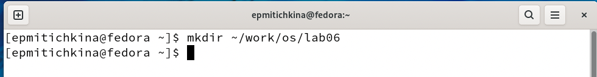  

2.	Перешла во вновь созданный каталог.

3.	Вызовала **vi** и создала файл **hello.sh**  
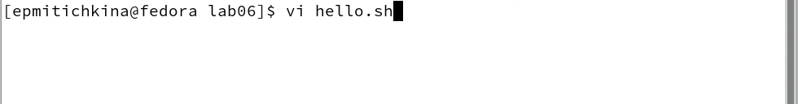
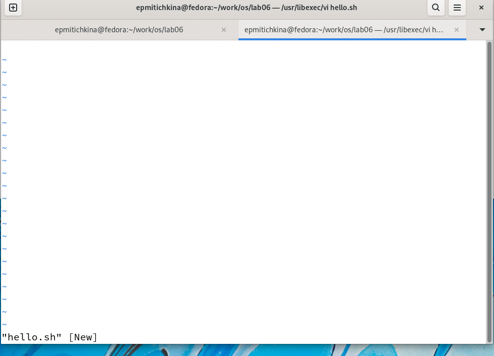
4.	Нажала клавишу  `i`	и ввела следующий текст.
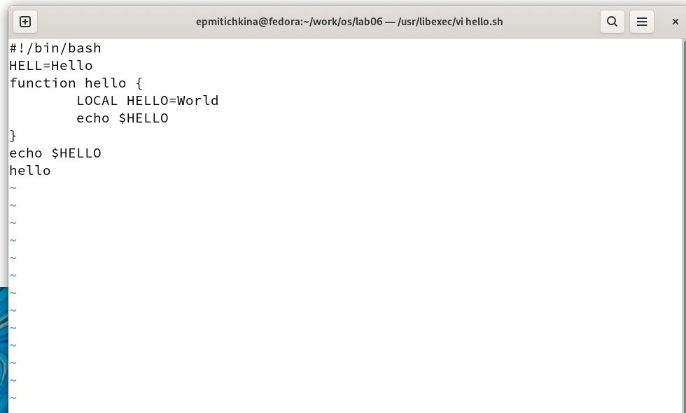
 
5.	Нажала клавишу `Esc` для перехода в командный режим после завершения ввода текста.

6.	Нажала `:`	для перехода в режим последней строки и внизу моего экрана появится приглашение в виде двоеточия.
 
7.	Нажала `w` (записать) и `q` (выйти), а затем нажала клавишу `Enter` для сохранения моего текста и завершения работы.
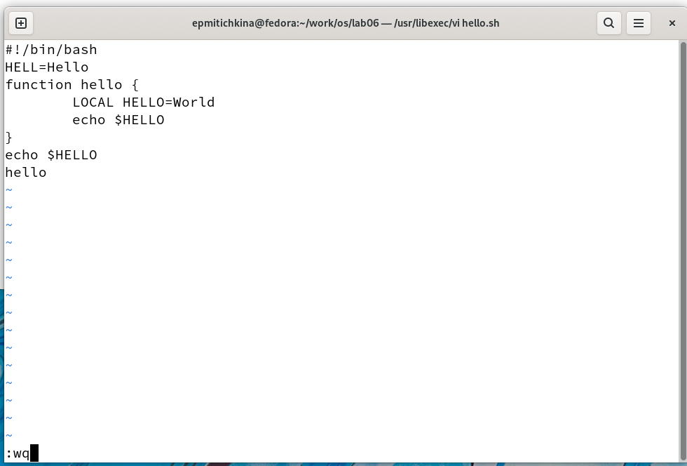
8.	Сделайте файл исполняемым
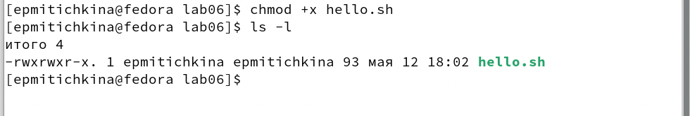

### Редактирование существующего файла:
1.	Вызвала **vi** на редактирование файла

 
2.	Установила курсор в конец слова **HELL** второй строки.

3.	Перешла в режим вставки и заменила на **HELLO**. Нажала `Esc` для возврата в командный режим.
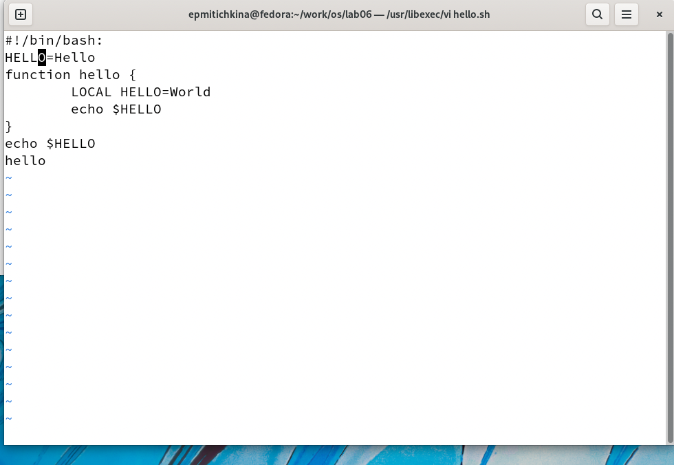
4.	Установила курсор на четвертую строку и стерла слово **LOCAL**.
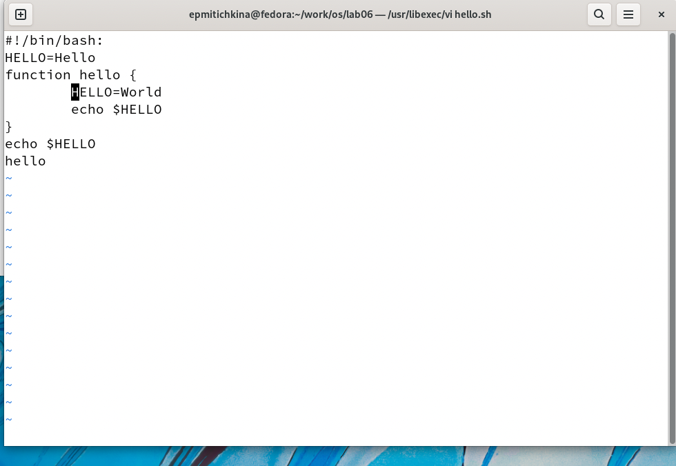
5.	Перешла в режим вставки и наберала следующий текст: **local**, нажала `Esc` для возврата в командный режим.
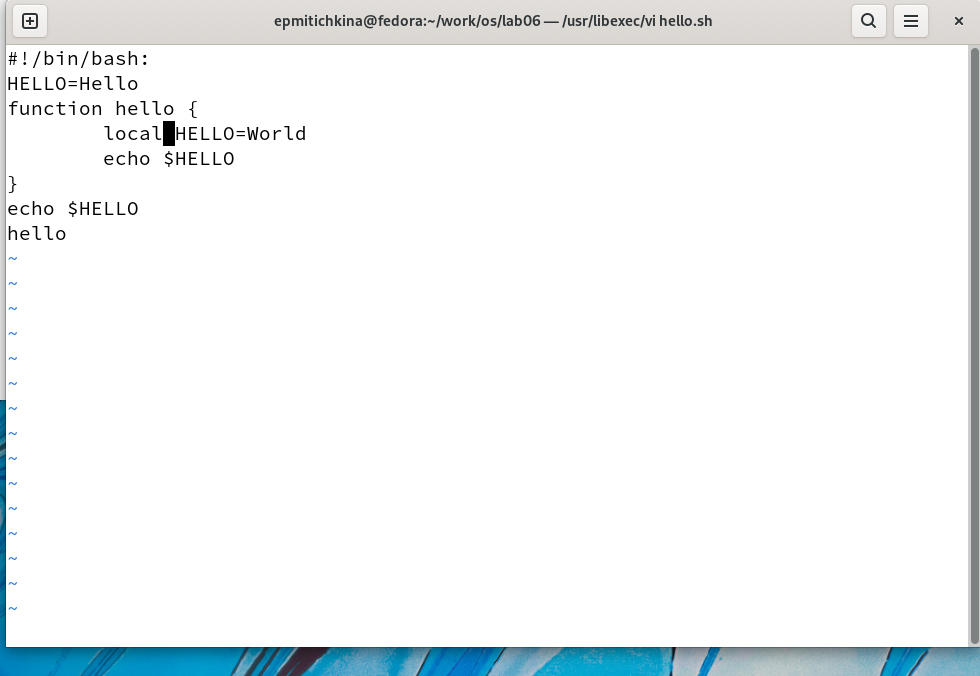
6.	Установила курсор на последней строке файла. Вставила после неё строку, содержащую следующий текст: **echo $HELLO**.
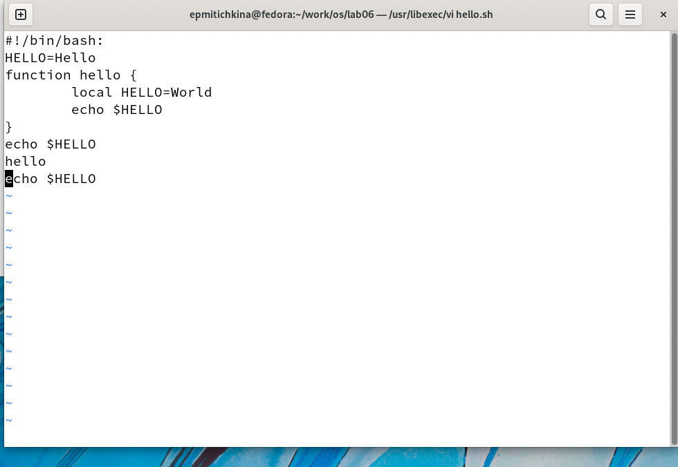
7.	Нажала 	`Esc` для перехода в командный режим.
8.	Удалила последнюю строку.
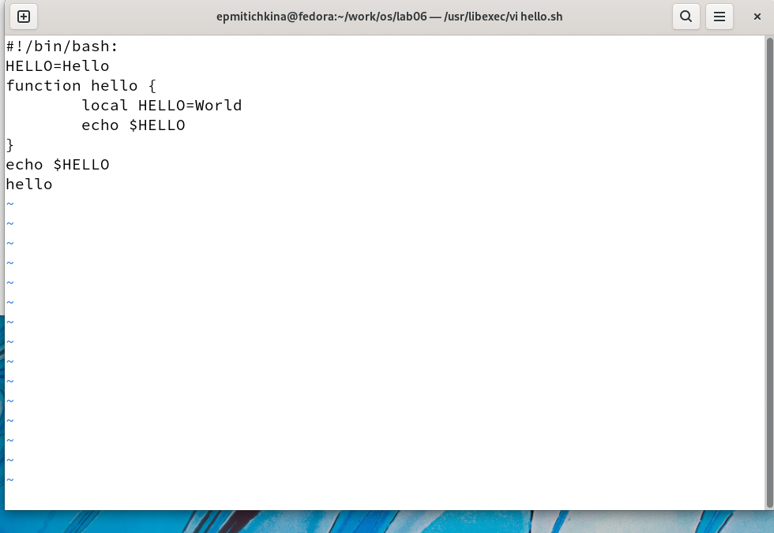
9.	Ввела команду отмены изменений `u` для отмены последней команды.
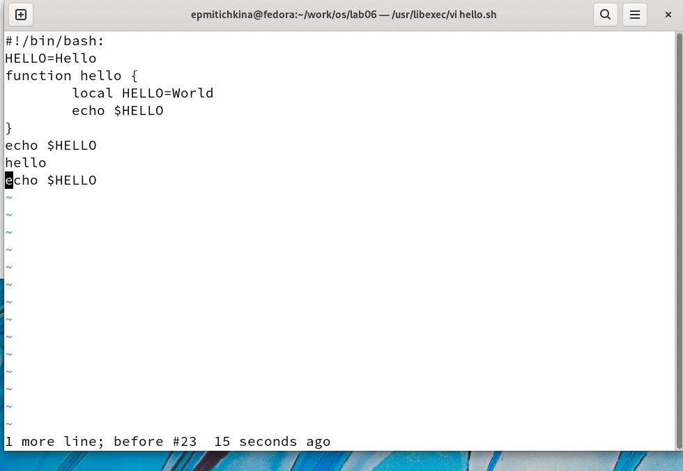
10.	Ввела символ `:`	для перехода в режим последней строки. Записала произведённые изменения и вышла из **vi**.
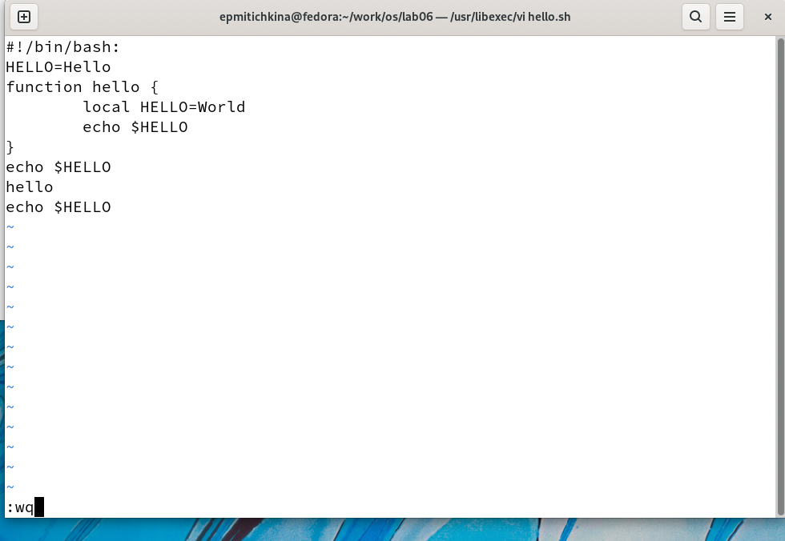

# Выводы
В результате работы познакомилась с операционной системой Linux. Получила практические навыки работы с редактором vi, установленным по умолчанию практически во всех дистрибутивах.


# Ответы на контрольные вопросы
1.	Дайте краткую характеристику режимам работы редактора vi.
    - Ввод текста
    - Командный режим
    - Режим командной строки
2.	Как выйти из редактора, не сохраняя произведённые изменения?  
`:q` или `:q!`  
3.	Назовите и дайте краткую характеристику командам позиционирования.
    -	`0 `(ноль) — переход в начало строки;
    -	`$` — переход в конец строки;
    -	`G` — переход в конец файла;
    -	𝑛 `G` — переход на строку с номером 𝑛.  
4.	Что для редактора vi является словом?  
Буквы отделеные пробелами с двух сторон 
    
5.	Каким образом из любого места редактируемого файла перейти в начало (конец) файла?  
    - начало - `1G`
    - конец - `G`
6.	Назовите и дайте краткую характеристику основным группам команд редактирования.
    ### Команды позиционирования
    
    -	`0 `(ноль) — переход в начало строки;
    -	`$` — переход в конец строки;
    -	`G` — переход в конец файла;
    -	𝑛 `G` — переход на строку с номером 𝑛.
    
    ### Команды перемещения по файлу
    
    - `Ctrl-d`— перейти на пол-экрана вперёд;
    -	`Ctrl-u`— перейти на пол-экрана назад;
    -	`Ctrl-f`— перейти на страницу вперёд;
    -	`Ctrl-b`— перейти на страницу назад.
    
    ### Команды перемещения по словам1
    
    - `W`  или `w`	— перейти на слово вперёд;
    -  𝑛 `W` или 𝑛 `w`— перейти на 𝑛 слов вперёд;
    -	`b`  или `B`	— перейти на слово назад;
    - 𝑛 `b` или 𝑛 `B` —	перейти на 𝑛 слов назад.
 
7.	Необходимо заполнить строку символами $. Каковы ваши действия? 
    1. Зайду в редактирование, напишу $
    2. Скапирую `y w`
    3. Далее вставлю `p`
8.	Как отменить некорректное действие, связанное с процессом редактирования?  
`u` - отмена последнее изменение  
9.	Назовите и дайте характеристику основным группам команд режима последней строки.
    ### Копирование и перемещение текста
    - `:` 𝑛,𝑚 `d` —	удалить строки с 𝑛 по 𝑚;
    - `:` 𝑖,𝑗 `m` 𝑘 — переместить строки с 𝑖 по 𝑗, начиная со строки 𝑘;
    - `:` 𝑖,𝑗 `t` 𝑘 — копировать строки с 𝑖 по 𝑗 в строку 𝑘;
    - `:` 𝑖,𝑗 `w` имя-файла — записать строки с 𝑖 по 𝑗 в файл с именем имя-файла.
    
    ### Запись в файл и выход из редактора
    
    - `: w` — записать изменённый текст в файл, не выходя из vi;
    - `: w`	имя-файла — записать изменённый текст в новый файл с именем имя-файла;
    - `: w !`	имя-файла — записать изменённый текст в файл с именем имя-файла;
    - `: w q`	— записать изменения в файл и выйти из vi;
    - `: q`	— выйти из редактора vi;
    - `: q !`	— выйти из редактора без записи;
    - `: e !`	— вернуться в командный режим, отменив все изменения, произведённые со времени последней записи.
    
    
10.	Как определить, не перемещая курсора, позицию, в которой заканчивается строка?
11.	Выполните анализ опций редактора vi (сколько их, как узнать их назначение и т.д.).
    ## Опции
        Опции редактора vi позволяют настроить рабочую среду. Для задания опций используется команда **set** (в режиме последней строки):
        - `:` set all — вывести полный список опций;
        – `:` set nu — вывести номера строк;
        –	`:` set list — вывести невидимые символы;
        –	`:` set ic — не учитывать при поиске, является ли символ прописным или строчным. 

12.	Как определить режим работы редактора vi?
*командный режим* — перемещение по файлу, стирание текста и другие редактирующие функции. Это - основной режим, только из него можно сразу перейти в другие режимы. Для возврата в основной режим из любого другого режима:
```
<ESC>, иногда 2 раза;
<Ctrl-[>
```
 - *режим вставки* - ввод текста. Как только завершается ввод текста, принято сразу возвращаться в обычный режим. Заметьте, что стирание и ввод текста происходит в двух разных режимах. Переход в него из обычного режима:
```
i
<Insert>
```
 *режим последней (или командной) строки* - Команды (операции с файлом, поиск и замена, настройка редактора…). Переход в него из обычного режима:
```
:
```
13.	Постройте граф взаимосвязи режимов работы редактора vi.
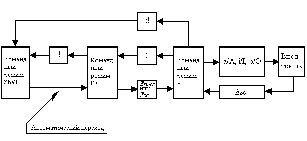