---
## Front matter
lang: ru-RU
title: lab11
author: |
	Kate P. Mitichkina \inst{1}
institute: |
	\inst{1}RUDN University, Moscow, Russian Federation
date: 26 May, 2022 Moscow, Russia

## Formatting
toc: false
slide_level: 2
theme: metropolis
header-includes: 
 - \metroset{progressbar=frametitle,sectionpage=progressbar,numbering=fraction}
 - '\makeatletter'
 - '\beamer@ignorenonframefalse'
 - '\makeatother'
aspectratio: 43
section-titles: true
---

# Цель работы

Изучить основы программирования в оболочке ОС UNIX. Научится писать более сложные командные файлы с использованием логических управляющих конструкций и циклов.

# Задача
1.	Используя команды getopts grep, написать командный файл, который анализирует командную строку с ключами:
-	-iinputfile — прочитать данные из указанного файла;
-	-ooutputfile — вывести данные в указанный файл;
-	-pшаблон — указать шаблон для поиска;
-	-C — различать большие и малые буквы;
-	-n — выдавать номера строк.  
а затем ищет в указанном файле нужные строки, определяемые ключом -p.
2.	Написать на языке Си программу, которая вводит число и определяет, является ли оно больше нуля, меньше нуля или равно нулю. Затем программа завершается с помощью функции exit(n), передавая информацию в о коде завершения в оболочку. Командный файл должен вызывать эту программу и, проанализировав с помощью команды $?, выдать сообщение о том, какое число было введено.
3.	Написать командный файл, создающий указанное число файлов, пронумерованных последовательно от 1 до 𝑁 (например 1.tmp, 2.tmp, 3.tmp,4.tmp и т.д.). Число файлов, которые необходимо создать, передаётся в аргументы командной строки. Этот же командный файл должен уметь удалять все созданные им файлы (если они существуют).
4.	Написать командный файл, который с помощью команды tar запаковывает в архив все файлы в указанной директории. Модифицировать его так, чтобы запаковывались только те файлы, которые были изменены менее недели тому назад (использовать команду find).

# Выполнение лабораторной работы
## Задание 1
1. Я создала два файла: prog1.sh и 1.txt (Рис. [-@fig:001]-[-@fig:002]) 

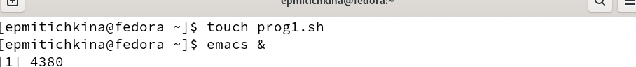{#fig:001 width=70%}

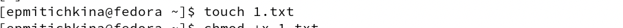{#fig:002 width=70%}

2. Написала код в редакторе emacs (Рис. [-@fig:003]-[-@fig:004]) 

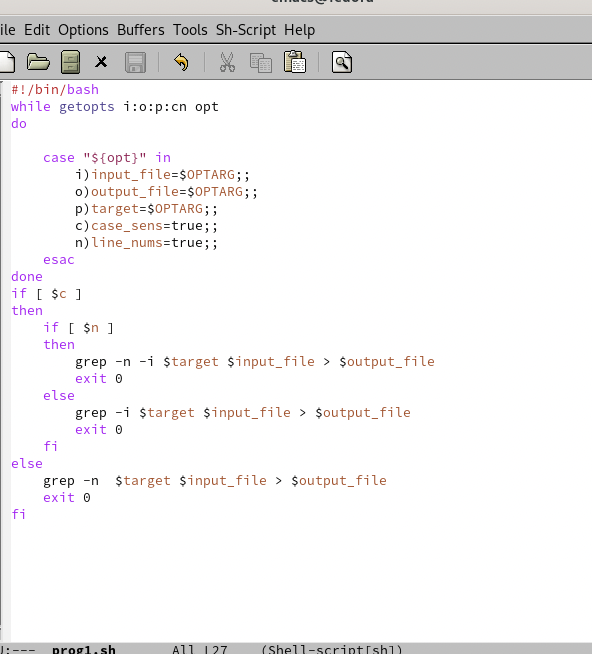{#fig:003 width=70%}

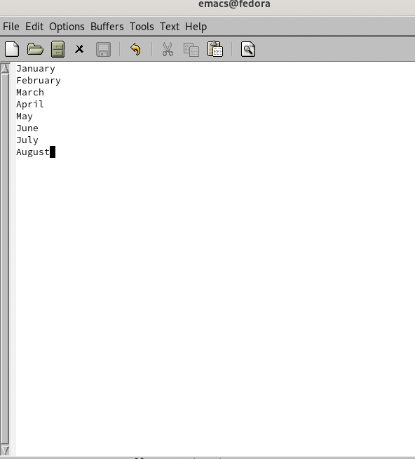{#fig:004 width=70%}

3. Предоставила право на выполнение и проверка файла (Рис. [-@fig:005]) 

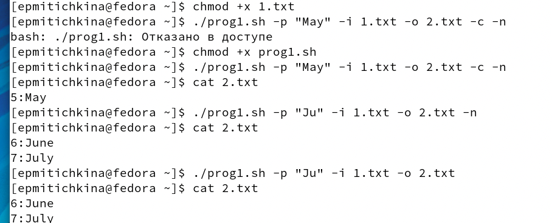{#fig:005 width=70%}

## Задание 2

1. Я создала два файла: prog2.sh и prog2.c (Рис. [-@fig:006]) 

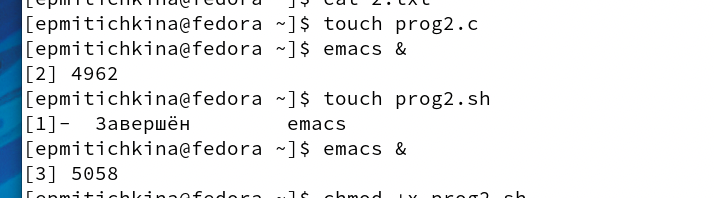{#fig:006 width=70%}

2. Написала код в редакторе emacs (Рис. [-@fig:007]-[-@fig:008]) 

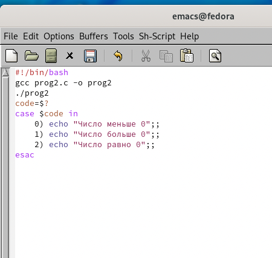{#fig:007 width=70%}

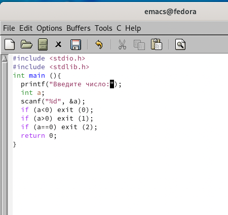{#fig:008 width=70%}

3. Предоставила право на выполнение и проверка файла  (Рис. [-@fig:009]) 

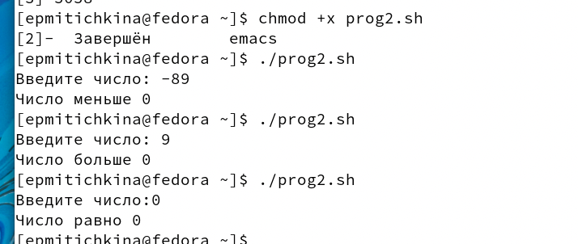{#fig:009 width=70%}

## Задание 3

1. Я создала два файла: prog3.sh (Рис. [-@fig:0010]) 

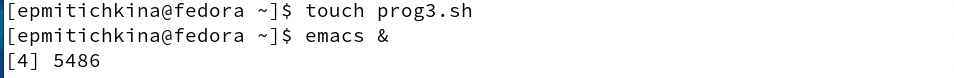{#fig:0010 width=70%}

2. Написала код в редакторе emacs (Рис. [-@fig:0011]) 

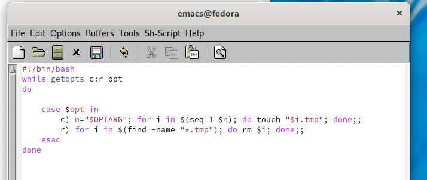{#fig:0011 width=70%}

3. Предоставила право на выполнение и проверка файла (Рис. [-@fig:0012]) 

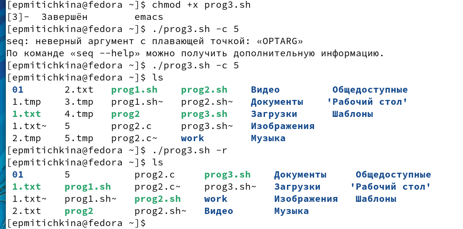{#fig:0012 width=70%}

## Задание 4

1. Я создала два файла: prog4.sh (Рис. [-@fig:0013]) 

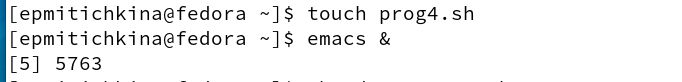{#fig:0013 width=70%}

2. Написала код в редакторе emacs (Рис. [-@fig:0014]) 

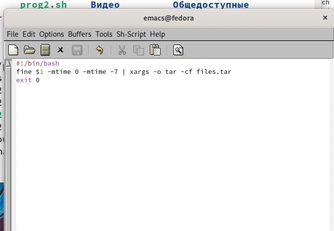{#fig:0014 width=70%}

3. Предоставила право на выполнение и проверка файла (Рис. [-@fig:0015]) 

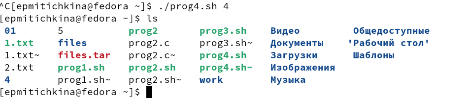{#fig:0015 width=70%}

# Выводы
В результате работы изучила основы программирования в оболочке ОС UNIX.  Научилась писать более сложные командные файлы с использованием логических управляющих конструкций и циклов.

