---
## Front matter
lang: ru-RU
title: lab12
author: |
	Kate P. Mitichkina \inst{1}
institute: |
	\inst{1}RUDN University, Moscow, Russian Federation
date: 26 May, 2022 Moscow, Russia

## Formatting
toc: false
slide_level: 2
theme: metropolis
header-includes: 
 - \metroset{progressbar=frametitle,sectionpage=progressbar,numbering=fraction}
 - '\makeatletter'
 - '\beamer@ignorenonframefalse'
 - '\makeatother'
aspectratio: 43
section-titles: true
---
# Цель работы

Изучить основы программирования в оболочке ОС UNIX. Научиться писать более сложные командные файлы с использованием логических управляющих конструкций и циклов.

# Задача
1.	Написать командный файл, реализующий упрощённый механизм семафоров. Командный файл должен в течение некоторого времени t1 дожидаться освобождения ресурса, выдавая об этом сообщение, а дождавшись его освобождения, использовать его в течение некоторого времени t2<>t1, также выдавая информацию о том, что ресурс используется соответствующим командным файлом (процессом). Запустить командный файл в одном виртуальном терминале в фоновом режиме, перенаправив его вывод в другой (> /dev/tty#, где # — номер терминала куда перенаправляется вывод), в котором также запущен этот файл, но не фоновом, а в привилегированном режиме. Доработать программу так, чтобы имелась возможность взаимодействия трёх и более процессов.
2.	Реализовать команду man с помощью командного файла. Изучите содержимое каталога /usr/share/man/man1. В нем находятся архивы текстовых файлов, содержащих справку по большинству установленных в системе программ и команд. Каждый архив можно открыть командой less сразу же просмотрев содержимое справки. Командный файл должен получать в виде аргумента командной строки название команды и в виде результата выдавать справку об этой команде или сообщение об отсутствии справки, если соответствующего файла нет в каталоге man1.
3.	Используя встроенную переменную $RANDOM, напишите командный файл, генерирующий случайную последовательность букв латинского алфавита. Учтите, что $RANDOM выдаёт псевдослучайные числа в диапазоне от 0 до 32767.

# Выполнение лабораторной работы
## Задание 1
1. Я создала файла prog1.sh 

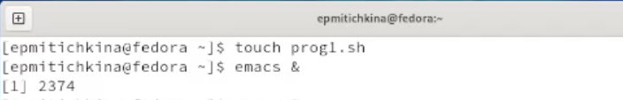   {#fig:001 width=70%}

2. Написала код в редакторе emacs 

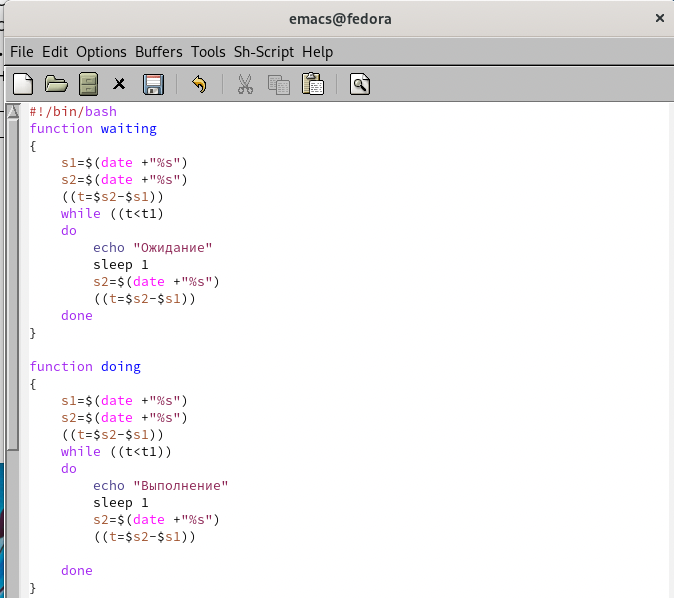{#fig:002 width=70%}

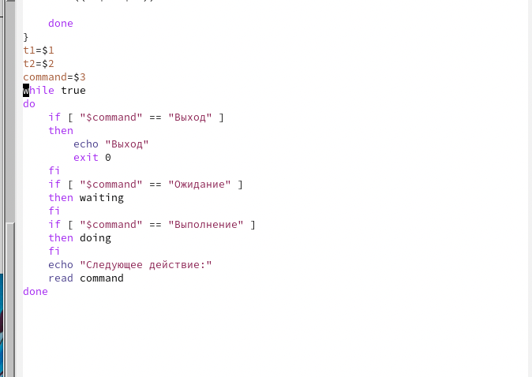{#fig:003 width=70%}

3. Предоставила право на выполнение и проверка файла 

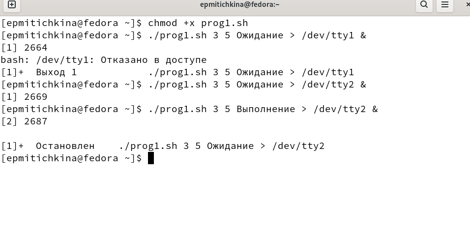{#fig:004 width=70%}

## Задание 2

1. Я проверила содержимое /usr/share/man/man1 

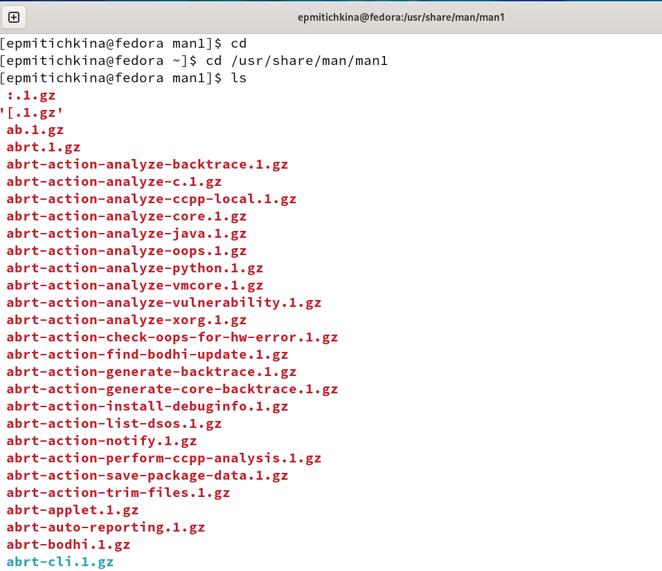{#fig:005 width=70%}

2. Я создала файл prog2.sh 

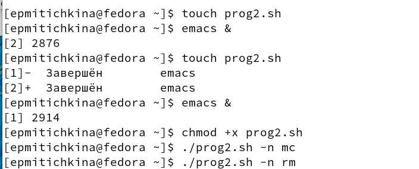{#fig:006 width=70%}

2. Написала код в редакторе emacs 

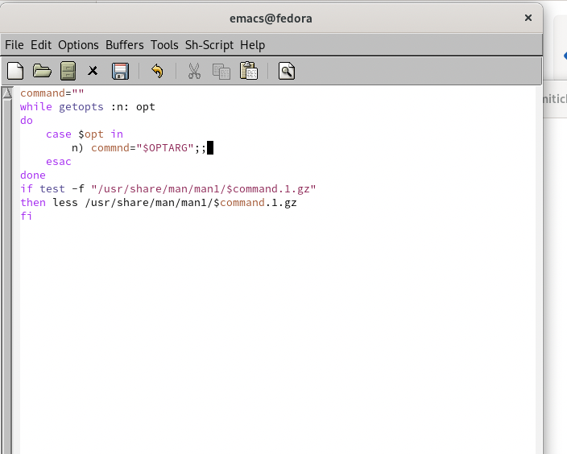{#fig:007 width=70%}

3. Предоставила право на выполнение и проверка файла  

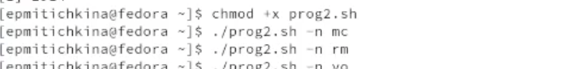{#fig:008 width=70%}

## Задание 3

1. Я создала файл prog3.sh  

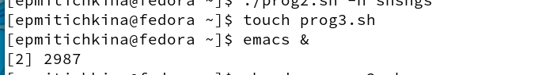{#fig:009 width=70%}

2. Написала код в редакторе emacs 

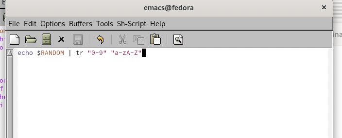{#fig:0010 width=70%}

3. Предоставила право на выполнение и проверка файла 

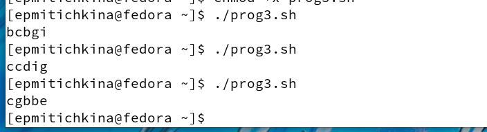{#fig:0011 width=70%}

# Выводы
В результате работы изучила основы программирования в оболочке ОС UNIX.  Научилась писать более сложные командные файлы с использованием логических управляющих конструкций и циклов.

