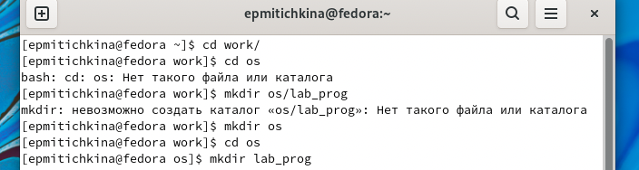
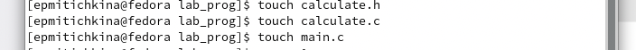
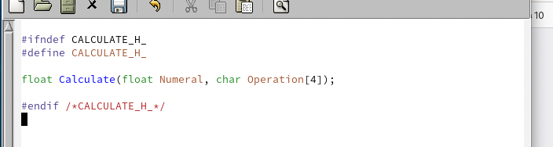
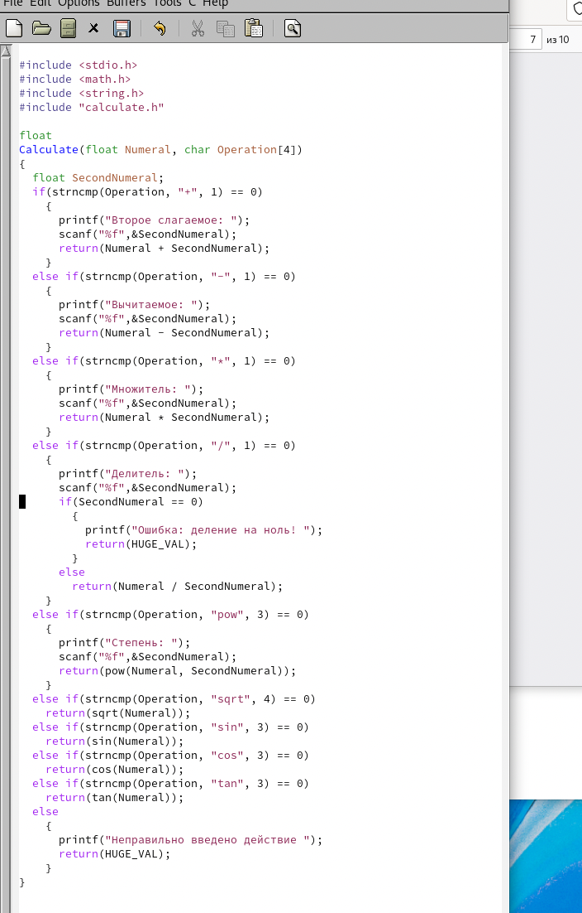
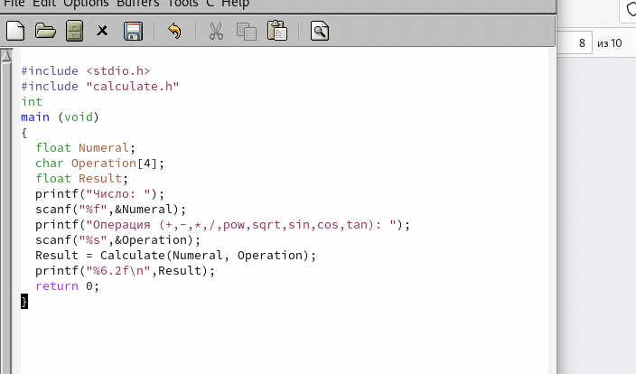
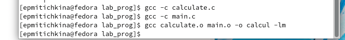
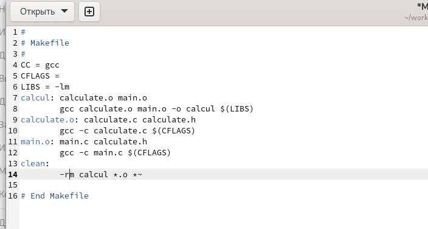
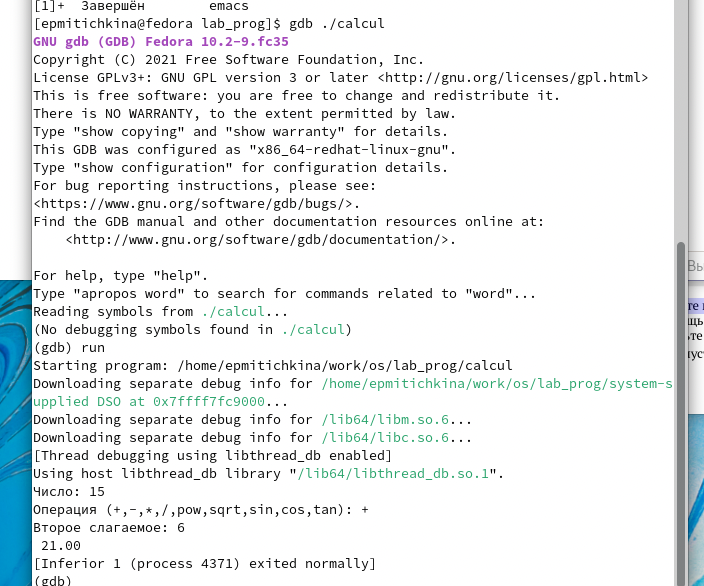
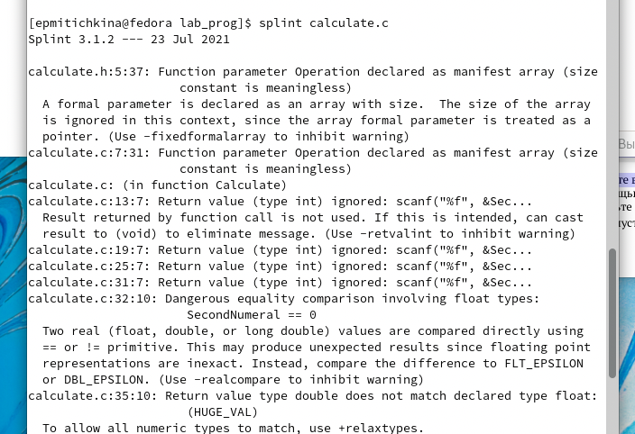
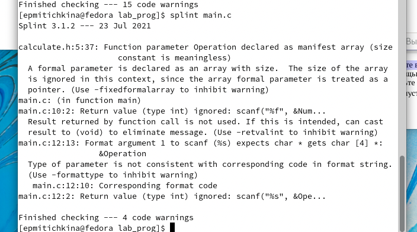

---
## Front matter
lang: ru-RU
title: lab13
author: |
	Kate P. Mitichkina \inst{1}
institute: |
	\inst{1}RUDN University, Moscow, Russian Federation
date: 1 Jun, 2022 Moscow, Russia

## Formatting
toc: false
slide_level: 2
theme: metropolis
header-includes: 
 - \metroset{progressbar=frametitle,sectionpage=progressbar,numbering=fraction}
 - '\makeatletter'
 - '\beamer@ignorenonframefalse'
 - '\makeatother'
aspectratio: 43
section-titles: true
---

# Цель работы

Приобрести простейшие навыки разработки, анализа, тестирования и отладки приложений в ОС типа UNIX/Linux на примере создания на языке программирования С калькулятора с простейшими функциями.


# Задача

1.	В домашнем каталоге создайте подкаталог ~/work/os/lab_prog.
2.	Создайте в нём файлы: calculate.h, calculate.c, main.c. Это будет примитивнейший калькулятор, способный складывать, вычитать, умножать и делить, возводить число в степень, брать квадратный корень, вычислять sin, cos, tan. При запуске он будет запрашивать первое число, операцию, второе число. После этого программа выведет результат и остановится.Реализация функций калькулятора в файле calculate.h:
```dotnetcli
////////////////////////////////////
// calculate.c

#include <stdio.h> 
#include <math.h> 
#include <string.h> 
#include "calculate.h"

float
Calculate(float Numeral, char Operation[4])
{
    float SecondNumeral;
    if(strncmp(Operation, "+", 1) == 0)
    {
        printf("Второе слагаемое: "); 
        scanf("%f",&SecondNumeral);
        return(Numeral + SecondNumeral);
    }
    else if(strncmp(Operation, "-", 1) == 0)
    {
        printf("Вычитаемое: "); 
        scanf("%f",&SecondNumeral); 
        return(Numeral - SecondNumeral);
    }
    else if(strncmp(Operation, "*", 1) == 0)
    {
        printf("Множитель: "); 
        scanf("%f",&SecondNumeral); 
        return(Numeral * SecondNumeral);
    }
    else if(strncmp(Operation, "/", 1) == 0)
    {
        printf("Делитель: ");
        scanf("%f",&SecondNumeral);
        if(SecondNumeral == 0)
        {
            printf("Ошибка: деление на ноль! ");
            return(HUGE_VAL);
        }    
        else
            return(Numeral / SecondNumeral);
    }
    else if(strncmp(Operation, "pow", 3) == 0)
    {
        printf("Степень: ");
        scanf("%f",&SecondNumeral);
        return(pow(Numeral, SecondNumeral));
    }
    else if(strncmp(Operation, "sqrt", 4) == 0)
        return(sqrt(Numeral));    
    else if(strncmp(Operation, "sin", 3) == 0)
        return(sin(Numeral));
    else if(strncmp(Operation, "cos", 3) == 0)
        return(cos(Numeral));
    else if(strncmp(Operation, "tan", 3) == 0)
        return(tan(Numeral));
    else
    {
        printf("Неправильно введено действие ");
        return(HUGE_VAL);
    }
}
```
Интерфейсный файл calculate.h, описывающий формат вызова функции калькулятора:
```dotnetcli
///////////////////////////////////////
// calculate.h

#ifndef CALCULATE_H_ #define CALCULATE_H_

float Calculate(float Numeral, char Operation[4]);

#endif /*CALCULATE_H_*/

```
Основной файл main.c, реализующий интерфейс пользователя к калькулятору:
```dotnetcli
////////////////////////////////////////
// main.c

#include <stdio.h> 
#include "calculate.h"

int
main (void)
{
    float Numeral; 
    char Operation[4]; 
    float Result; 
    printf("Число: ");
    scanf("%f",&Numeral);
    printf("Операция (+,-,*,/,pow,sqrt,sin,cos,tan): "); 
    scanf("%s",&Operation);
    Result = Calculate(Numeral, Operation); 
    printf("%6.2f\n",Result);
    return 0;
}

```
3.	Выполните компиляцию программы посредством gcc:
```
gcc -c calculate.c gcc -c main.c
gcc calculate.o main.o -o calcul -lm
```
4.	При необходимости исправьте синтаксические ошибки.
5.	Создайте Makefile со следующим содержанием:
```dotnetcli
#
# Makefile #

CC = gcc CFLAGS =
LIBS = -lm

calcul: calculate.o main.o
gcc calculate.o main.o -o calcul $(LIBS)

calculate.o: calculate.c calculate.h gcc -c calculate.c $(CFLAGS)

main.o: main.c calculate.h
gcc -c main.c $(CFLAGS)

clean:
-rm calcul *.o *~

# End Makefile

```
Поясните в отчёте его содержание.
6.	С помощью gdb выполните отладку программы calcul (перед использованием gdb исправьте  Makefile):
-	Запустите отладчик GDB, загрузив в него программу для отладки:
```dotnetcli
gdb ./calcul
```
-	Для запуска программы внутри отладчика введите команду run:
```dotnetcli
run
```
-	Для постраничного (по 9 строк) просмотра исходного код используйте команду list:
```dotnetcli
list
```
-	Для просмотра строк с 12 по 15 основного файла используйте list с параметрами:
```
list 12,15
```
-	Для просмотра определённых строк не основного файла используйте list с параметрами:
```dotnetcli
list calculate.c:20,29
```
-	Установите точку останова в файле calculate.c на строке номер 21:
```dotnetcli
list calculate.c:20,27 
break 21
```
-	Выведите информацию об имеющихся в проекте точка останова:
```dotnetcli
info breakpoints
```
- Запустите программу внутри отладчика и убедитесь, что программа остановится в момент прохождения точки останова:
```dotnetcli
run 5
-
backtrace
```

- Отладчик выдаст следующую информацию:
```dotnetcli
#0 Calculate (Numeral=5, Operation=0x7fffffffd280 "-")
at calculate.c:21
#1 0x0000000000400b2b in main () at main.c:17
```
а команда backtrace покажет весь стек вызываемых функций от начала программы до текущего места.
-	Посмотрите, чему равно на этом этапе значение переменной Numeral, введя:
```
print Numeral
```
На экран должно быть выведено число 5.
-	Сравните с результатом вывода на экран после использования команды:
```dotnetcli
display Numeral
```
-	Уберите точки останова:
```dotnetcli
info breakpoints 
delete 1
```

7.	С помощью утилиты splint попробуйте проанализировать коды файлов calculate.c и main.c.


# Выполнение лабораторной работы

1. Я создала файла подкаталог ~/work/os/lab_prog.




2. Создала в нём файлы: calculate.h, calculate.c, main.c. И реализовала код.










3. Выполнила компиляцию программы



5. Создала Makefile 



6. С помощью gdb выполнила отладку программы calcul 



7. Проанализировала коды файла calculate.c и main.c.






# Выводы

В результате работы приобрела простейшие навыки разработки, анализа, тестирования и отладки приложений в ОС типа UNIX/Linux на примере создания на языке программирования С калькулятора с простейшими функциями.
