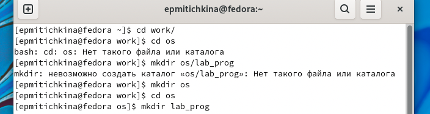
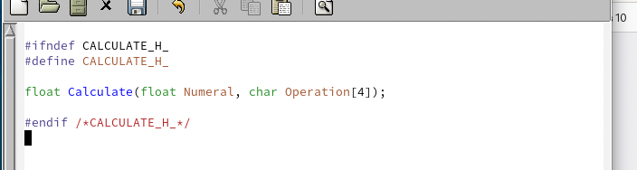
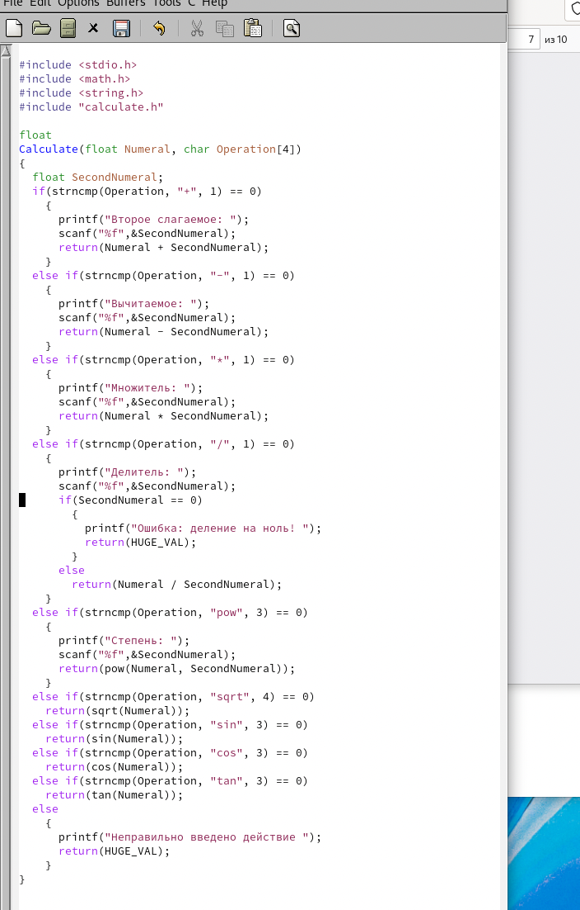
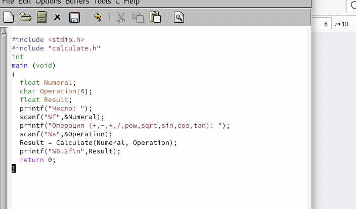
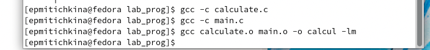
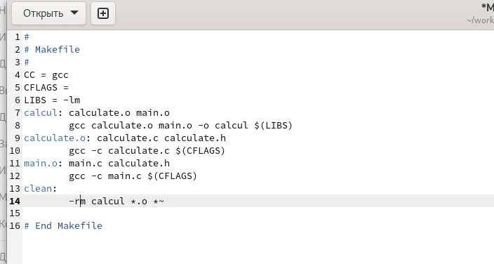
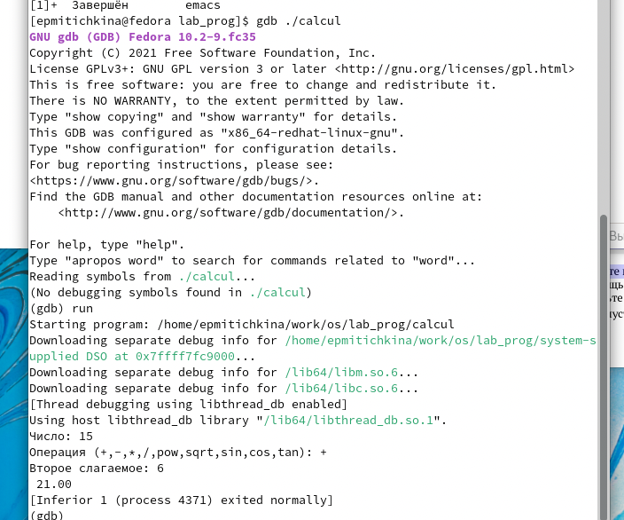
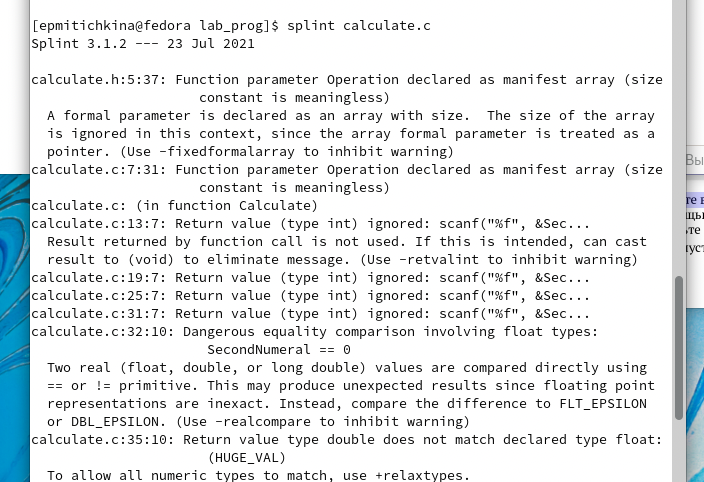
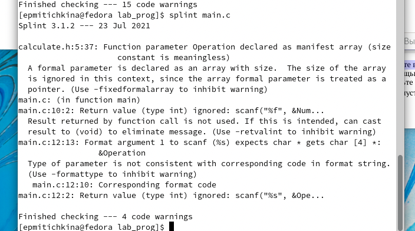

---
## Front matter
title: "Отчёт по лабораторной работе №13"
subtitle: "Средства, применяемые при разработке программного обеспечения в ОС типа UNIX/Linux"
author: "Митичкина Екатерина Павловна"

## Generic otions
lang: ru-RU
toc-title: "Содержание"

## Bibliography
bibliography: bib/cite.bib
csl: pandoc/csl/gost-r-7-0-5-2008-numeric.csl

## Pdf output format
toc: true # Table of contents
toc-depth: 2
lof: true # List of figures
lot: true # List of tables
fontsize: 12pt
linestretch: 1.5
papersize: a4
documentclass: scrreprt
## I18n polyglossia
polyglossia-lang:
  name: russian
  options:
	- spelling=modern
	- babelshorthands=true
polyglossia-otherlangs:
  name: english
## I18n babel
babel-lang: russian
babel-otherlangs: english
## Fonts
mainfont: PT Serif
romanfont: PT Serif
sansfont: PT Sans
monofont: PT Mono
mainfontoptions: Ligatures=TeX
romanfontoptions: Ligatures=TeX
sansfontoptions: Ligatures=TeX,Scale=MatchLowercase
monofontoptions: Scale=MatchLowercase,Scale=0.9
## Biblatex
biblatex: true
biblio-style: "gost-numeric"
biblatexoptions:
  - parentracker=true
  - backend=biber
  - hyperref=auto
  - language=auto
  - autolang=other*
  - citestyle=gost-numeric
## Pandoc-crossref LaTeX customization
figureTitle: "Рис."
tableTitle: "Таблица"
listingTitle: "Листинг"
lofTitle: "Список иллюстраций"
lotTitle: "Список таблиц"
lolTitle: "Листинги"
## Misc options
indent: true
header-includes:
  - \usepackage{indentfirst}
  - \usepackage{float} # keep figures where there are in the text
  - \floatplacement{figure}{H} # keep figures where there are in the text
---

# Цель работы

Приобрести простейшие навыки разработки, анализа, тестирования и отладки приложений в ОС типа UNIX/Linux на примере создания на языке программирования С калькулятора с простейшими функциями.


# Задача

1.	В домашнем каталоге создайте подкаталог ~/work/os/lab_prog.
2.	Создайте в нём файлы: calculate.h, calculate.c, main.c. Это будет примитивнейший калькулятор, способный складывать, вычитать, умножать и делить, возводить число в степень, брать квадратный корень, вычислять sin, cos, tan. При запуске он будет запрашивать первое число, операцию, второе число. После этого программа выведет результат и остановится.Реализация функций калькулятора в файле calculate.h:
```dotnetcli
////////////////////////////////////
// calculate.c

#include <stdio.h> 
#include <math.h> 
#include <string.h> 
#include "calculate.h"

float
Calculate(float Numeral, char Operation[4])
{
    float SecondNumeral;
    if(strncmp(Operation, "+", 1) == 0)
    {
        printf("Второе слагаемое: "); 
        scanf("%f",&SecondNumeral);
        return(Numeral + SecondNumeral);
    }
    else if(strncmp(Operation, "-", 1) == 0)
    {
        printf("Вычитаемое: "); 
        scanf("%f",&SecondNumeral); 
        return(Numeral - SecondNumeral);
    }
    else if(strncmp(Operation, "*", 1) == 0)
    {
        printf("Множитель: "); 
        scanf("%f",&SecondNumeral); 
        return(Numeral * SecondNumeral);
    }
    else if(strncmp(Operation, "/", 1) == 0)
    {
        printf("Делитель: ");
        scanf("%f",&SecondNumeral);
        if(SecondNumeral == 0)
        {
            printf("Ошибка: деление на ноль! ");
            return(HUGE_VAL);
        }    
        else
            return(Numeral / SecondNumeral);
    }
    else if(strncmp(Operation, "pow", 3) == 0)
    {
        printf("Степень: ");
        scanf("%f",&SecondNumeral);
        return(pow(Numeral, SecondNumeral));
    }
    else if(strncmp(Operation, "sqrt", 4) == 0)
        return(sqrt(Numeral));    
    else if(strncmp(Operation, "sin", 3) == 0)
        return(sin(Numeral));
    else if(strncmp(Operation, "cos", 3) == 0)
        return(cos(Numeral));
    else if(strncmp(Operation, "tan", 3) == 0)
        return(tan(Numeral));
    else
    {
        printf("Неправильно введено действие ");
        return(HUGE_VAL);
    }
}
```
Интерфейсный файл calculate.h, описывающий формат вызова функции калькулятора:
```dotnetcli
///////////////////////////////////////
// calculate.h

#ifndef CALCULATE_H_ #define CALCULATE_H_

float Calculate(float Numeral, char Operation[4]);

#endif /*CALCULATE_H_*/

```
Основной файл main.c, реализующий интерфейс пользователя к калькулятору:
```dotnetcli
////////////////////////////////////////
// main.c

#include <stdio.h> 
#include "calculate.h"

int
main (void)
{
    float Numeral; 
    char Operation[4]; 
    float Result; 
    printf("Число: ");
    scanf("%f",&Numeral);
    printf("Операция (+,-,*,/,pow,sqrt,sin,cos,tan): "); 
    scanf("%s",&Operation);
    Result = Calculate(Numeral, Operation); 
    printf("%6.2f\n",Result);
    return 0;
}

```
3.	Выполните компиляцию программы посредством gcc:
```
gcc -c calculate.c gcc -c main.c
gcc calculate.o main.o -o calcul -lm
```
4.	При необходимости исправьте синтаксические ошибки.
5.	Создайте Makefile со следующим содержанием:
```dotnetcli
#
# Makefile #

CC = gcc CFLAGS =
LIBS = -lm

calcul: calculate.o main.o
gcc calculate.o main.o -o calcul $(LIBS)

calculate.o: calculate.c calculate.h gcc -c calculate.c $(CFLAGS)

main.o: main.c calculate.h
gcc -c main.c $(CFLAGS)

clean:
-rm calcul *.o *~

# End Makefile

```
Поясните в отчёте его содержание.
6.	С помощью gdb выполните отладку программы calcul (перед использованием gdb исправьте  Makefile):
-	Запустите отладчик GDB, загрузив в него программу для отладки:
```dotnetcli
gdb ./calcul
```
-	Для запуска программы внутри отладчика введите команду run:
```dotnetcli
run
```
-	Для постраничного (по 9 строк) просмотра исходного код используйте команду list:
```dotnetcli
list
```
-	Для просмотра строк с 12 по 15 основного файла используйте list с параметрами:
```
list 12,15
```
-	Для просмотра определённых строк не основного файла используйте list с параметрами:
```dotnetcli
list calculate.c:20,29
```
-	Установите точку останова в файле calculate.c на строке номер 21:
```dotnetcli
list calculate.c:20,27 
break 21
```
-	Выведите информацию об имеющихся в проекте точка останова:
```dotnetcli
info breakpoints
```
- Запустите программу внутри отладчика и убедитесь, что программа остановится в момент прохождения точки останова:
```dotnetcli
run 5
-
backtrace
```

- Отладчик выдаст следующую информацию:
```dotnetcli
#0 Calculate (Numeral=5, Operation=0x7fffffffd280 "-")
at calculate.c:21
#1 0x0000000000400b2b in main () at main.c:17
```
а команда backtrace покажет весь стек вызываемых функций от начала программы до текущего места.
-	Посмотрите, чему равно на этом этапе значение переменной Numeral, введя:
```
print Numeral
```
На экран должно быть выведено число 5.
-	Сравните с результатом вывода на экран после использования команды:
```dotnetcli
display Numeral
```
-	Уберите точки останова:
```dotnetcli
info breakpoints 
delete 1
```

7.	С помощью утилиты splint попробуйте проанализировать коды файлов calculate.c и main.c.

# Теоретическое введение: 

Процесс разработки программного обеспечения обычно разделяется на следующие этапы:
-	планирование, включающее сбор и анализ требований к функционалу и другим характеристикам разрабатываемого приложения;
-	проектирование, включающее в себя разработку базовых алгоритмов и спецификаций, определение языка программирования;
-	непосредственная разработка приложения:
-	кодирование — по сути создание  исходного текста  программы (возможно в нескольких вариантах);
-	анализ разработанного кода;
-	сборка, компиляция и разработка исполняемого модуля;
-	тестирование и отладка, сохранение произведённых изменений;
-	документирование.  

Для создания исходного текста программы разработчик может воспользоваться любым удобным для него редактором текста: vi, vim, mceditor, emacs, geany и др.  
После завершения написания исходного кода программы (возможно состоящей из нескольких файлов), необходимо её скомпилировать и получить исполняемый модуль.


# Выполнение лабораторной работы

1. Я создала файла подкаталог ~/work/os/lab_prog.




2. Создала в нём файлы: calculate.h, calculate.c, main.c. И реализовала код.









3. Выполнила компиляцию программы



5. Создала Makefile 



6. С помощью gdb выполнила отладку программы calcul 



7. Проанализировала коды файла calculate.c и main.c.






# Выводы

В результате работы приобрела простейшие навыки разработки, анализа, тестирования и отладки приложений в ОС типа UNIX/Linux на примере создания на языке программирования С калькулятора с простейшими функциями.

# Ответы на контрольные вопросы

1. Как получить информацию о возможностях программ gcc, make, gdb и др.?   

Спросить в интернете или использовать утилиту man, также можно использовать опцию -h у gcc для получения дополнительной информации.

2. Назовите и дайте краткую характеристику основным этапам разработки приложений в UNIX.

Процесс разработки программного обеспечения обычно разделяется на следующие этапы: 
- планирование, включающее сбор и анализ требований к функционалу и другим характеристикам разрабатываемого приложения; 
- проектирование, включающее в себя разработку базовых алгоритмов и спецификаций, определение языка программирования; 
-  непосредственная разработка приложения: 
- кодирование — по сути создание исходного текста программы (возможно в нескольких вариантах); 
-  анализ разработанного кода; 
- сборка, компиляция и разработка исполняемого модуля; 
- тестирование и отладка, сохранение произведённых изменений; 
-  документирование. 
- 
Для создания исходного текста программы разработчик может воспользоваться любым удобным для него редактором текста: vi, vim, mceditor, emacs, geany и др.   
После завершения написания исходного кода программы (возможно состоящей из нескольких файлов), необходимо её скомпилировать и получить исполняемый модуль.

3. Что такое суффикс в контексте языка программирования?Приведите примеры использования.

Суффикс - это составная часть имени файла, например его расширение.

4. Каково основное назначение компилятора языка С в UNIX?

Преобразование исходного кода программ в объектные файлы.

5. Для чего предназначена утилита make?

Утилита make позволяет автоматизировать процесс преобразования файлов программы из одной формы в другую, отслеживает взаимосвязи между файлами.

6. Приведите пример структуры Makefile. Дайте характеристику основным элементам этого файла.

В самом простом случае Makefile имеет следующий синтаксис:
```
<цель_1> <цель_2> ... : 
<зависимость_1> <зависимость_2> ...
<команда 1>
...
<команда n>
```
Сначала задаётся список целей, разделённых пробелами, за которым идёт двоеточие и список зависимостей. Затем в следующих строках указываются команды. Строки с командами обязательно должны начинаться с табуляции.   
В качестве цели в Makefile может выступать имя файла или название какого-то действия. Зависимость задаёт исходные параметры (условия) для достижения указанной цели. Зависимость также может быть названием какого-то действия. Команды — собственно действия, которые необходимо выполнить для достижения цели. Рассмотрим пример Makefile для написанной выше простейшей программы, выводящей на экран приветствие
```
 ’Hello World!’:
hello: main.c
gcc -o hello main.c
```
Здесь в первой строке hello — цель, main.c — название файла, который мы хотим скомпилировать; во второй строке, начиная с табуляции, задана команда компиляции gcc с опциями. Для запуска программы необходимо в командной строке набрать команду make:
```
make
```
Общий синтаксис Makefile имеет вид:
```
 target1 [target2...]:[:] [dependment1...]
 [(tab)commands] [#commentary]
 [(tab)commands] [#commentary]
```
Здесь знак # определяет начало комментария (содержимое от знака # и до конца строки не будет обрабатываться. Одинарное двоеточие указывает на то, что последовательность команд должна содержаться в одной строке. Для переноса можно в длинной строке команд можно использовать обратный слэш (\). Двойное двоеточие указывает на то, что последовательность команд может содержаться в нескольких последовательных строках

7. Назовите основное свойство, присущее всем программам отладки. Что необходимо сделать, чтобы его можно было использовать?

Возможность останавливать выполнение программы на определенных строчках кода. Для этого нужно установить так называемые брейкпоинты.

8. Назовите и дайте основную характеристику основным командам отладчика gdb.

Установка брейкопинтов, пошаговое выполнение отлаживаемой программы, вывод исходного кода постранично или построчно, возможность узнать значение переменных.

9. Опишите по шагам схему отладки программы, которую Вы использовали при выполнении лабораторной работы.

    1.	Установка брейкпоинтов
    2.	Пошаговое исполнение программы и вывод значения переменных

10. Прокомментируйте реакцию компилятора на синтаксические ошибки в программе при его первом запуске.

Процесс компиляции аварийно завершается, указывая на ошибки.

11. Назовите основные средства, повышающие понимание исходного кода программы.

Комментарии, единый стиль кода, линтеры.

1. Каковы основные задачи, решаемые программой splint?

Увидеть ошибки и предупреждения, указывающие на различные проблемы в коде программы.
