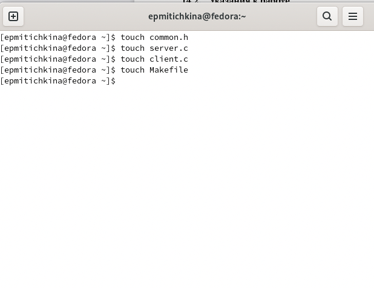
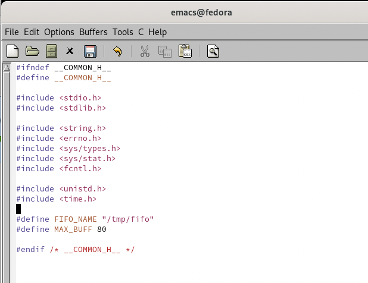
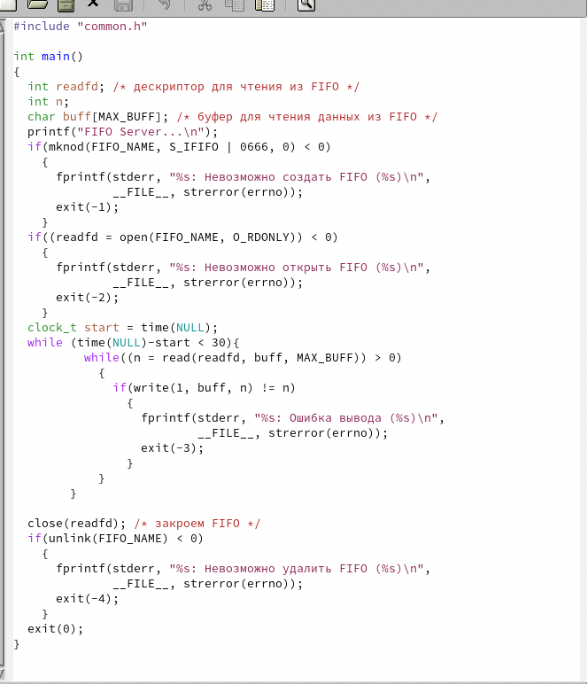
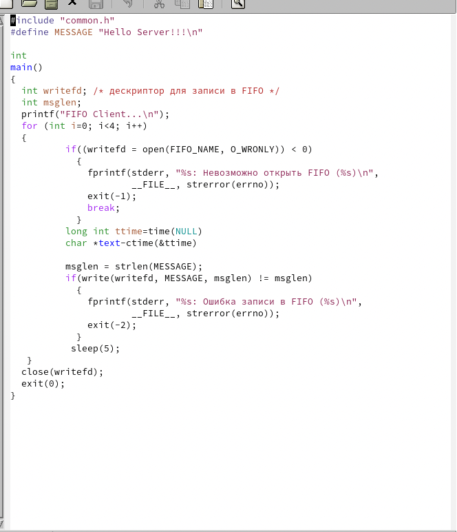
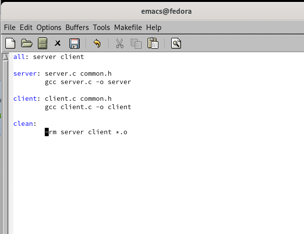
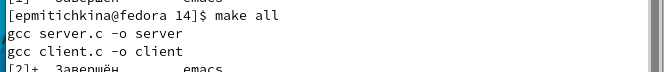
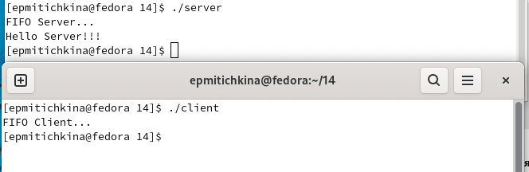

---
## Front matter
lang: ru-RU
title: lab14
author: |
	Kate P. Mitichkina \inst{1}
institute: |
	\inst{1}RUDN University, Moscow, Russian Federation
date: 2 Jun, 2022 Moscow, Russia

## Formatting
toc: false
slide_level: 2
theme: metropolis
header-includes: 
 - \metroset{progressbar=frametitle,sectionpage=progressbar,numbering=fraction}
 - '\makeatletter'
 - '\beamer@ignorenonframefalse'
 - '\makeatother'
aspectratio: 43
section-titles: true
---

# Цель работы

Приобретение практических навыков работы с именованными каналами.

# Задача

Изучите приведённые в тексте программы server.c и client.c. Взяв данные примеры за образец, напишите аналогичные программы, внеся следующие изменения:
1.	Работает не 1 клиент, а несколько (например, два).
2.	Клиенты передают текущее время с некоторой периодичностью (например, раз в пять секунд). Используйте функцию sleep() для приостановки работы клиента.
3.	Сервер работает не бесконечно, а прекращает работу через некоторое время (например, 30 сек). Используйте функцию clock() для определения времени работы сервера. Что будет в случае, если сервер завершит работу, не закрыв канал?

# Выполнение лабораторной работы

1. Я создала файлы common.h, server.c, client.c, Makefile.

2. Открыла emacs и  реализовала код.

3. Скомпилировала файл

4. Проверила работу файлов

# Выводы

В результате работы приобрела практические навыков работы с именованными каналами.
