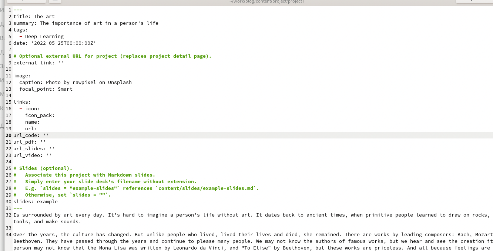
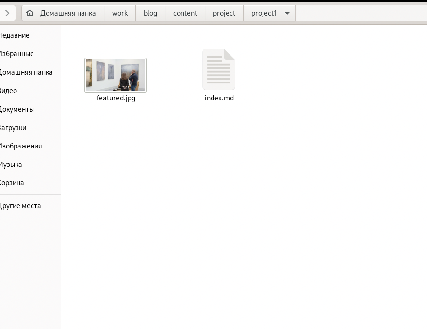
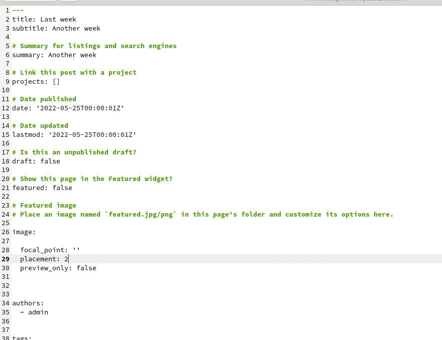
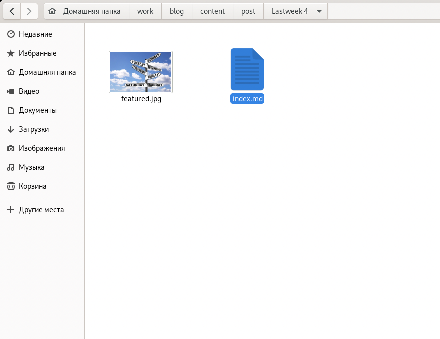
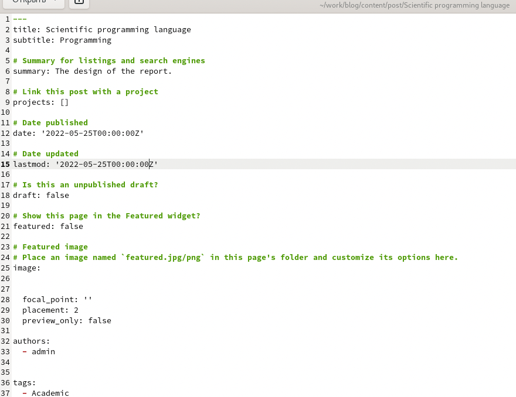
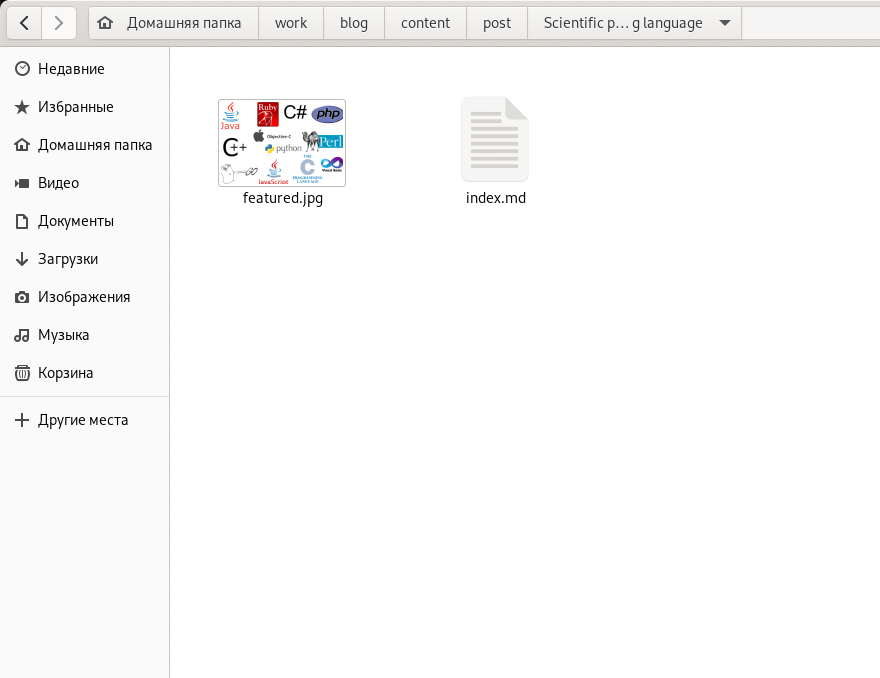
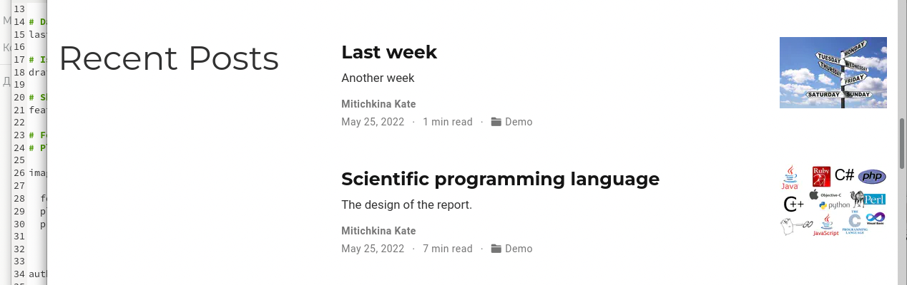
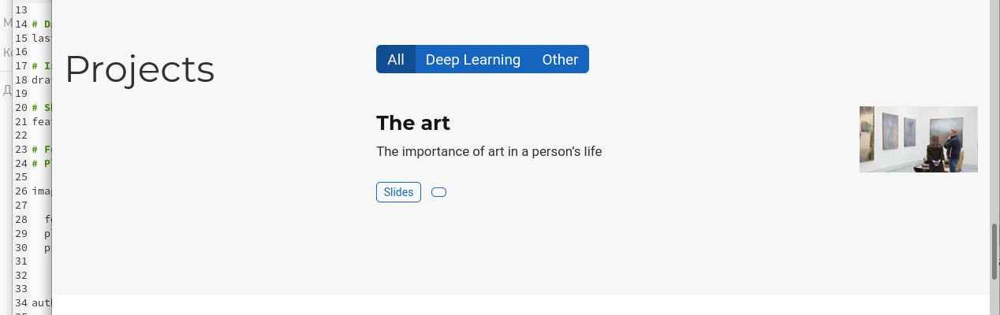

---
## Front matter
lang: ru-RU
title: stage5
author: |
	Kate P. Mitichkina \inst{1}
institute: |
	\inst{1}RUDN University, Moscow, Russian Federation
date: 25 May, 2022 Moscow, Russia

## Formatting
toc: false
slide_level: 2
theme: metropolis
header-includes: 
 - \metroset{progressbar=frametitle,sectionpage=progressbar,numbering=fraction}
 - '\makeatletter'
 - '\beamer@ignorenonframefalse'
 - '\makeatother'
aspectratio: 43
section-titles: true
---

# Цель работы

Добавить к сайту все остальные элементы.
# Задание

1. Сделать записи для персональных проектов.
2. Сделать пост по прошедшей неделе.
3. Добавить пост на тему по выбору.
    - Языки научного программирования.

# Выполнение лабораторной работы

1. С начала я создала запись для персональных проектов. Для этого я скопировала примерную папку и изменила ее   содержание ~/work/blog/content/project/project1. Также поменяла картинку 
{ #fig:001 width=70% }
{ #fig:002 width=70% }

2. Перешла в ~/work/blog/content/post/Lastweek4. Добавила фото и написала пост в файл index.md о  прошедшей неделе

{ #fig:003 width=70% }
{ #fig:004 width=70% }

3. Перешла в ~/work/blog/content/post/Scientific programming languages. Добавила фото и написала пост в файл index.md по теме Языки научного программирования.
{ #fig:005 width=70% }
{ #fig:006 width=70% }

4. Проверяю все на сайте 
{ #fig:007 width=70% }
{ #fig:008 width=70% }
# Выводы

В результате работы добавила к сайту все остальные элементы.

