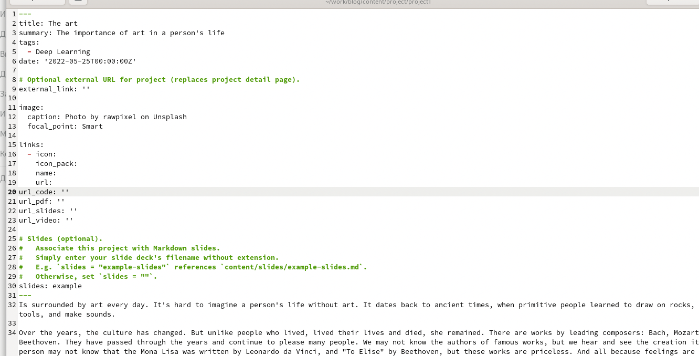
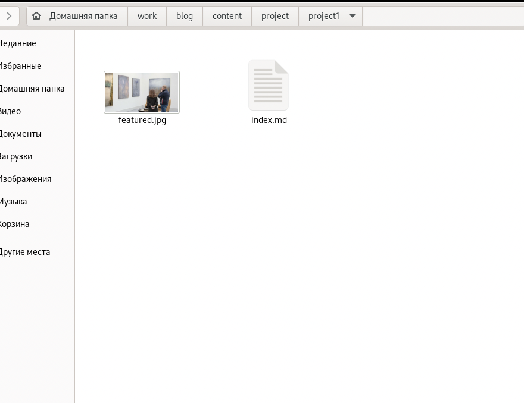
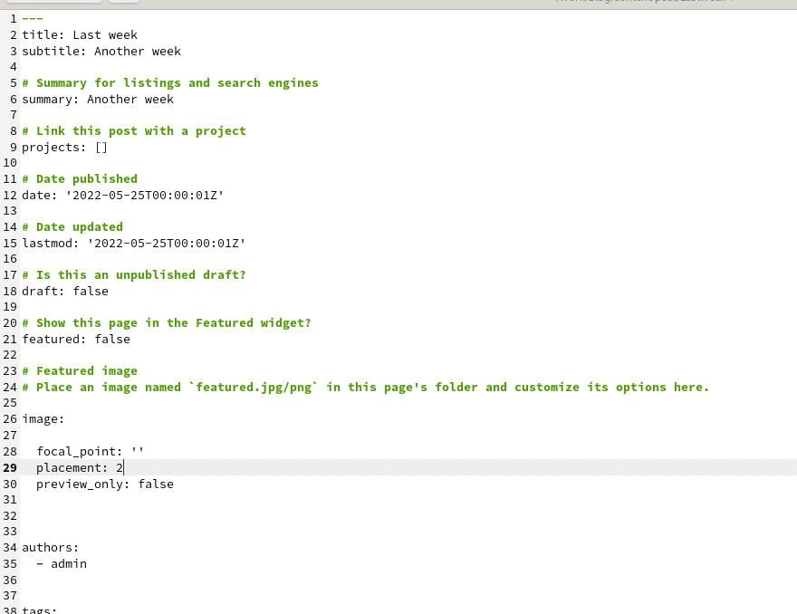
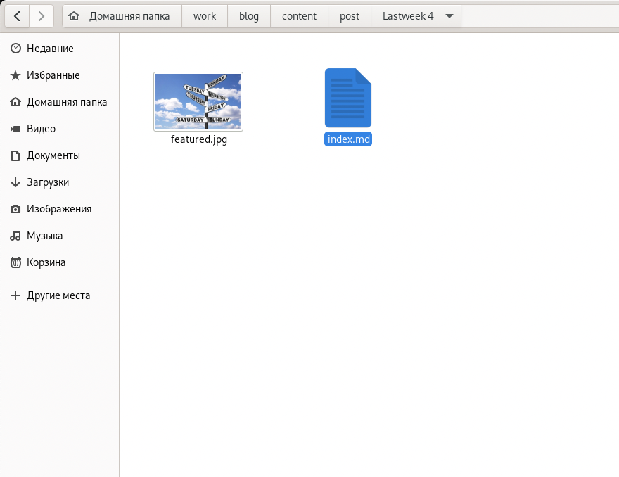
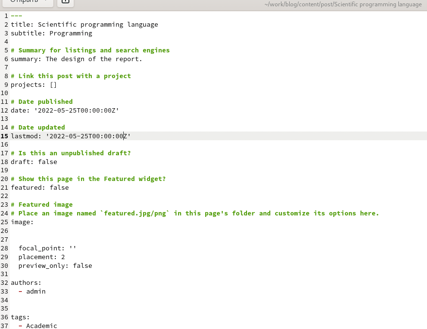
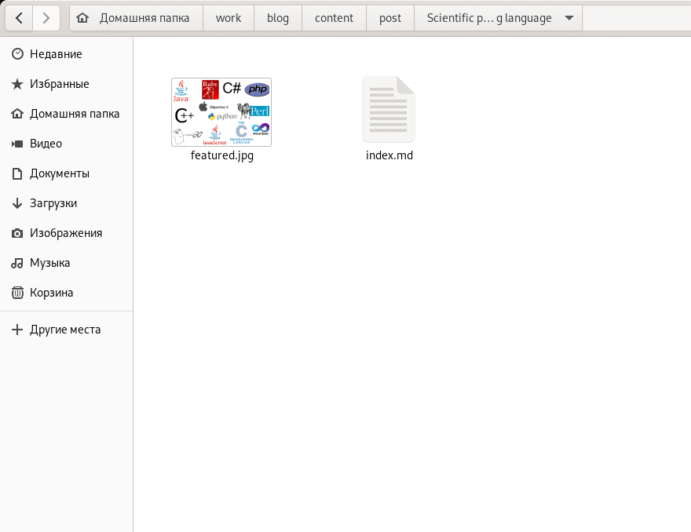
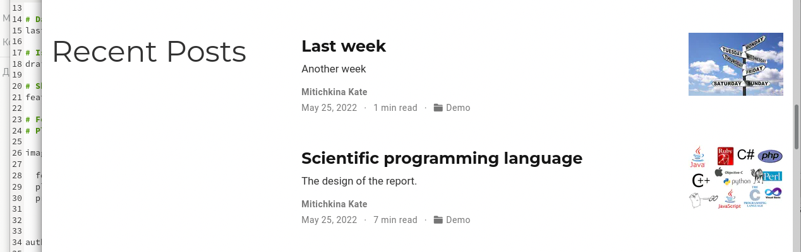
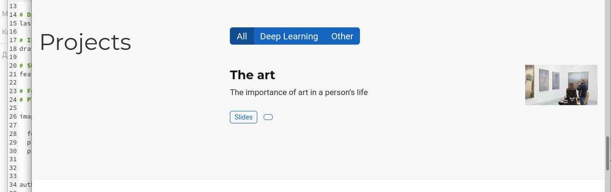

---
## Front matter
title: "Отчёт по индивидуальному проекту"
subtitle: "Этап 5"
author: "Митичкина Екатерина Павловна"

## Generic otions
lang: ru-RU
toc-title: "Содержание"

## Bibliography
bibliography: bib/cite.bib
csl: pandoc/csl/gost-r-7-0-5-2008-numeric.csl

## Pdf output format
toc: true # Table of contents
toc-depth: 2
lof: true # List of figures
lot: true # List of tables
fontsize: 12pt
linestretch: 1.5
papersize: a4
documentclass: scrreprt
## I18n polyglossia
polyglossia-lang:
  name: russian
  options:
	- spelling=modern
	- babelshorthands=true
polyglossia-otherlangs:
  name: english
## I18n babel
babel-lang: russian
babel-otherlangs: english
## Fonts
mainfont: PT Serif
romanfont: PT Serif
sansfont: PT Sans
monofont: PT Mono
mainfontoptions: Ligatures=TeX
romanfontoptions: Ligatures=TeX
sansfontoptions: Ligatures=TeX,Scale=MatchLowercase
monofontoptions: Scale=MatchLowercase,Scale=0.9
## Biblatex
biblatex: true
biblio-style: "gost-numeric"
biblatexoptions:
  - parentracker=true
  - backend=biber
  - hyperref=auto
  - language=auto
  - autolang=other*
  - citestyle=gost-numeric
## Pandoc-crossref LaTeX customization
figureTitle: "Рис."
tableTitle: "Таблица"
listingTitle: "Листинг"
lofTitle: "Список иллюстраций"
lotTitle: "Список таблиц"
lolTitle: "Листинги"
## Misc options
indent: true
header-includes:
  - \usepackage{indentfirst}
  - \usepackage{float} # keep figures where there are in the text
  - \floatplacement{figure}{H} # keep figures where there are in the text
---

# Цель работы

Добавить к сайту все остальные элементы.

# Задание

1. Сделать записи для персональных проектов.
2. Сделать пост по прошедшей неделе.
3. Добавить пост на тему по выбору.
    - Языки научного программирования.

# Выполнение лабораторной работы

1. С начала я создала запись для персональных проектов. Для этого я скопировала примерную папку и изменила ее   содержание ~/work/blog/content/project/project1. Также поменяла картинку 
{ #fig:001 width=70% }
{ #fig:002 width=70% }

2. Перешла в ~/work/blog/content/post/Lastweek4. Добавила фото и написала пост в файл index.md о  прошедшей неделе

{ #fig:003 width=70% }
{ #fig:004 width=70% }

3. Перешла в ~/work/blog/content/post/Scientific programming languages. Добавила фото и написала пост в файл index.md по теме Языки научного программирования.
{ #fig:005 width=70% }
{ #fig:006 width=70% }

4. Проверяю все на сайте 
{ #fig:007 width=70% }
{ #fig:008 width=70% }

# Выводы

В результате работы добавила к сайту все остальные элементы.

